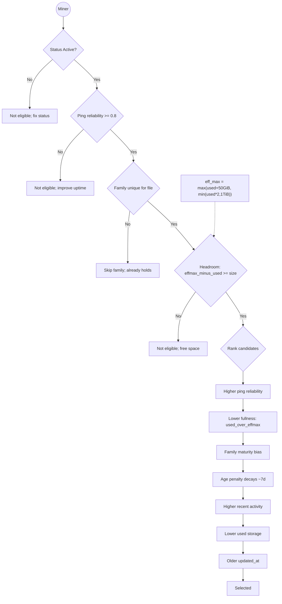

## HIPPIUS file placement and incentives

This document explains, end-to-end, how files are scheduled onto miners and how the rules incentivize good behavior. It aligns with the current implementation across `assign`, `rebalance`, and `exports`.

### Goals
- Keep exactly R replicas per file (default R=5) across independent families
- Prefer reliable, available miners without centralizing on a few
- Respect storage capacity and avoid overfilling individual miners
- Heal under/over replication automatically
- Expose only active placements in profiles

### Key terms
- Family: `family = COALESCE(miners.main_node_id, miners.node_id)`
- Active miner: `miners.status = 'Active'`
- Active replica: `user_file_replicas.status = 'Active'`
- Ping reliability: `miner_ping_stats.last10_success_ratio` (avg of last 10 pings)
- Replication factor: `HIPPIUS__ASSIGN__REPLICAS` (default 5, bounds 1..20)

### Inputs considered
- Miner status: only `Active` miners are eligible
- Family diversity: at most one replica per family per file
- Ping reliability: candidates must meet a minimum reliability (≥ 0.8 by default)
- Capacity: place where there is headroom relative to current usage
- Fairness: balance load (prefer less utilized miners/families)

### Effective capacity and headroom
During rebalancing, a miner’s admissible headroom uses a dynamic envelope to bound growth and protect hot miners:

- `effective_max = max(used_storage + 50 GiB, min(used_storage * 2, 1 TiB))`
- A candidate is considered only if `(effective_max - used_storage) >= file_size`

This creates at least 50 GiB of headroom, tapers growth as miners fill, and caps bursts.

### Initial assignment (ingest → placement)
When a file is requested and admitted (credits ok), we target `R` replicas:
1. Build eligible families: all `Active` miners, grouped by `family`
2. Exclude families already holding a replica of this file
3. For each new family, pick one miner:
   - Skip miners already holding this user-file
   - Prefer the least utilized miner (`used_storage` ascending)
4. Assign up to `R` families (one replica each), enforcing unique `replica_order`
5. If fewer than `R` could be placed, we keep partial progress and retry later (rebalance)

Notes:
- Credits/reservations are checked against `R * file_size` prior to commit
- Miner aggregates (`used_storage`, `total_files`) are updated via triggers on replica insert/delete/status change

### Rebalancing (healing under/over replication)
Rebalancing periodically:
1. Detects offline or unsuitable placements and marks those replicas `Inactive`
2. For each lost replica, finds replacement candidates with the following filter/order:
   - Filter:
     - `m.status = 'Active'`
     - Exclude original miner and families already used by this file
     - `ping_reliability ≥ 0.8` (from `miner_ping_stats`)
     - Family age gate: `family_age_days ≥ 3` (slow ramp-up for brand-new families)
     - Has capacity: `(effective_max - used_storage) ≥ file_size`
   - Order (best first):
     - Higher `ping_reliability`
     - Lower fullness (`used_storage / effective_max`)
     - Slight preference for more mature families (higher `family_active_replicas`)
     - Age penalty for very young families (decays to zero over ~7 days)
     - Higher `recent_activity_ratio`
     - Lower `used_storage`
     - Older `updated_at`
3. Inserts a new active replica on the best candidate per missing family
4. Over-replication is detected and trimmed, prioritizing removal from less desirable placements

Important: We removed the strict “online in last 10 minutes” gate in favor of the more stable `ping_reliability` metric. This prevents files from getting stranded at 4/5 while still favoring consistently available miners.

### Family diversity
- Exactly one replica per family per file
- Families are derived from `main_node_id`; standalone miners form their own family
- This thwarts gaming by many linked nodes in the same family

### Reputation (availability and performance)
- Primary reputation signal: `miner_ping_stats.last10_success_ratio`
- Threshold default: `≥ 0.8` (tolerates intermittent failures)
- Additional signals used for ranking: `recent_activity_ratio`, fullness ratio

### Miner weight scoring (on-chain)
- **Scope**: Only `StorageMiner` nodes receive a non-zero weight.
- **Family aggregation**: All calculations aggregate the main miner with its `linked_nodes` (family).
- **Profile gating for pin component**: If neither the miner nor any linked node has a non-empty profile, the pin-success component contributes `0`.

- **Inputs**:
  - **Overall pin success ratio (family-wide)**: Uses cumulative totals from `NodeMetricsData` across the miner + linked nodes.
    - `pin_success_ratio = total_successful_pins / total_pins`
    - Mapped to an integer score in `[0, 1000]`.
    - If `total_pins == 0`, this score is `0`.
  - **Storage share (family-wide)**: Sum of file sizes across the miner + linked nodes, divided by total network storage from `ipfs_pallet`.
    - The percentage (scaled to parts-per-million) is mapped via a piecewise curve to `[500, 60000]`.
    - Higher share → higher score; ensures a meaningful baseline even for small storage.

- **Combination and bounds**:
  - **Weighted blend**: \( base\_weight = (80\% \times file\_size\_score) + (20\% \times pin\_score) \), implemented as integer arithmetic:
    - `base_weight = (file_size_score * 80 + pin_score * 20) / 100`
  - **Clamp**: `final_weight = clamp(base_weight, 1, 65535)`
  - **Temporal smoothing**: If a previous weight exists for the miner, blend to reduce volatility:
    - `updated_weight = 0.7 * previous_weight + 0.3 * final_weight` (integer math)

- **Notes**:
  - Ping reliability (`last10_success_ratio`) is enforced in placement eligibility/ranking, not directly in the weight formula; it affects weight indirectly by influencing who accumulates stored bytes and sustained pin success.
  - Helper scoring functions for ping, storage-proof, reputation bonus, and diversity exist but are not currently included in the final weight.
  - Even if the pin component is `0` due to missing profile or no overall pins, the storage-share component still contributes to weight.

### What profiles show
- User profiles list only active replicas on active miners
- If a file shows fewer than `R` replicas, it is under-replicated and queued for healing

### Incentives and anti-cheat
- Higher reliability → more eligible placements
- Lower fullness → preferred for new replicas
- Family diversity ensures horizontal spread across independent operators
- Dynamic headroom prevents monopolization by already-hot miners

Family ramp-up (anti-gaming)
- New families get a slight age penalty that decays over ~7 days, slowing immediate dominance by freshly introduced clusters
- Ranking includes a mild bias toward families with more existing active replicas (maturity signal), without locking out newcomers

### Ping history and stats hygiene
- When a miner is not `Active`, its historical pings are purged (`miner_pings` rows removed) and its `miner_ping_stats` row is deleted
- Very old pings are trimmed (e.g., older than 7 days) to keep storage bounded
- Reliability uses recent samples (rolling last-10); if stats are missing, reliability effectively behaves like `0.0`, so the candidate fails the `≥ 0.8` gate until fresh pings accumulate

### Convergence of existing allocations
- Existing replicas on too-new families are gradually moved by the rebalancer and backfilled on eligible families
- Convergence speed can be tuned via `rebalance.batch_limit` or by triggering an on-demand rebalancing pass

### Failure and partial progress
- If no candidates meet constraints, we keep existing replicas and retry later
- This ensures liveness without sacrificing diversity/capacity/security rules

### Future improvements
- Make thresholds configurable (reliability cutoffs, headroom envelope)
- Publish per-file replication health in profiles (`expected_replicas`, `total_active_replicas`)
- Optional manifest + chunked export format to scale massive profiles

### Diagram: What makes a “good” miner (eligibility and ranking)

Checklist to be a top candidate
- Keep node `Active` and reachable
- Maintain ≥80% ping reliability over recent checks
- Ensure free space; avoid running near full
- Limit linked nodes per family (one replica per family)
- Maintain steady recent activity

